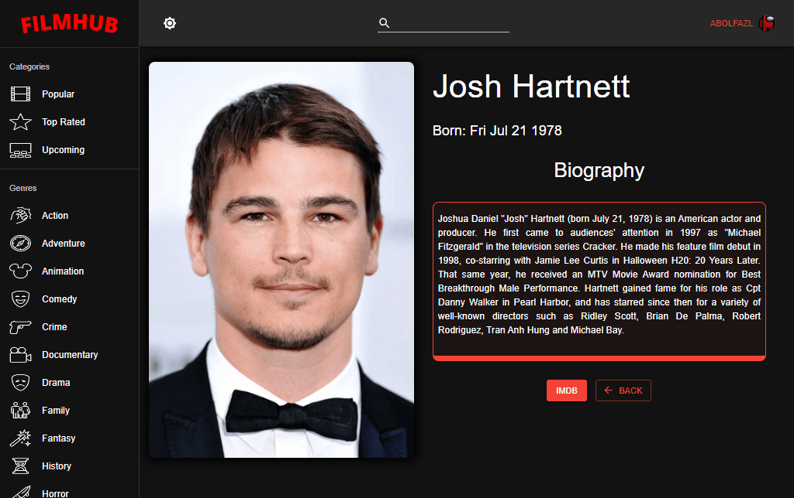
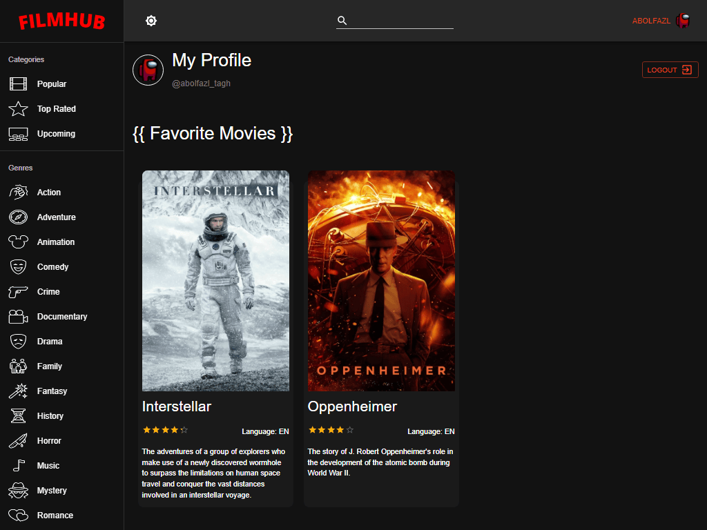

# 🎬 Filmhub

### Filmhub is a comprehensive app for movie lovers. The app features a wide variety of movie from all over the world. Users can use the app to find their favorite movies and get comprehensive information about them.(اگه ایران هستید از فیلترشکن استفاده کنید)

### Key features of FilmHub:
- Access to a wide variety of movies
- Ability to search for movies by genre, category, name and other factors
- Access to comprehensive information about each movie including plot summary, cast, rating, release date, and much more...
- Ability to watch movie trailer
- Ability to view recommended movies based on user interests
- Ability to access comprehensive information about actors, including movies they have appeared in, biographies and more...
- Ability to log in to your account and save favorite movies and watchlists

## Link 🔗 [https://charactermi.github.io/film_hub](https://charactermi.github.io/film_hub)

 

# Preview

 

# Mobile Responsive

# Technologies

 

<ul>
    <li>
        
    </li>
    <li>
        
    </li>
    <li>
        
    </li>
    <li>
        
    </li>
    <li>
        
    </li>
    <li>
        
    </li>
</ul>